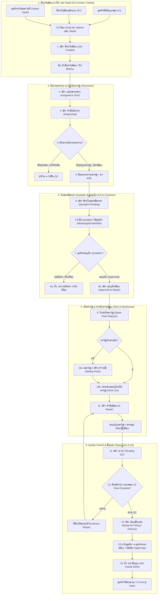
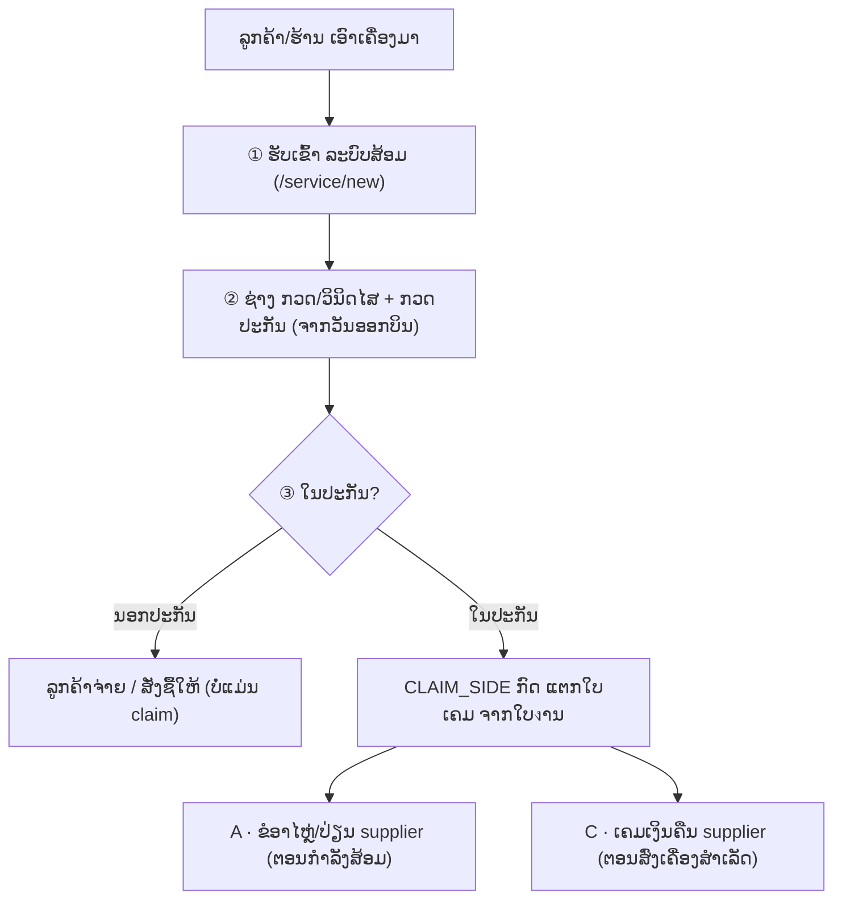

# 🔄 Workflow — ຂັ້ນຕອນການເຮັດວຽກ ODSS

ເອກະສານນີ້ອະທິບາຍ **ວົງຈອນ 12 ຂັ້ນຕອນຂອງງານສ້ອມ** (Repair Workflow), ຂະບວນການຕິດຕັ້ງ, ເຄລມ, ບຳລຸງຮັກສາ (PM) ແລະ ການສັ່ງຊື້ອາໄຫຼ່ (PR/PO).

---

## 1. ພາບລວມ 12 ຂັ້ນຕອນງານສ້ອມ (End-to-End Repair Workflow)

---

## 2. ຕາຕະລາງ Swimlane 12 ຂັ້ນຕອນ

| ຂັ້ນ | ສະຖານະ (State) | ຜູ້ຮັບຜິດຊອບ | ເຄື່ອງມື / ໃບງານ | ຜົນທີ່ໄດ້ (Deliverable) |
|-----|----------------|--------------|-------------------|--------------------------|
| 1 | ຮັບແຈ້ງສ້ອມ (`new`) | CS Counter | Web `/repair/new` | ເລກ Job Ticket + ໃບຮັບສ້ອມ |
| 2 | ມອບໝາຍຊ່າງ (`assigned`) | ຫົວໜ້າ / CS | Web / App | ຊ່າງໄດ້ຮັບ Job Notification |
| 3 | ກຳລັງວິເຄາະ (`diagnosing`) | ຊ່າງສ້ອມ (Tech) | App มือถือ | ຜົນວິເຄາະ Root Cause |
| 4 | ປະເມີນອາໄຫຼ່/ຄ່າສ້ອມ | ຊ່າງສ້ອມ (Tech) | Web / App | ລາຍການອາໄຫຼ່ + ປະເມີນຄ່າແຮງ |
| 5 | ສ້າງ Quotation (`quotation`) | CS / ຫົວໜ້າ | Web `/quotations` | ໃບສະເໜີລາຄາ (Quotation PDF) |
| 6 | ລໍອະນຸມັດລູກຄ້າ | CS Counter | WhatsApp / SMS | ຜົນອະນຸມັດຈາກລູກຄ້າ |
| 7 | ເບີກອາໄຫຼ່ (`parts_req`) | ຊ່າງ + ຝ່າຍສາງ | Web `/stock` | ອາໄຫຼ່ຖືກເບີກອອກຈາກສາງ |
| 8 | ລໍອາໄຫຼ່ (`waiting_parts`) | ຝ່າຍສາງ (Stock) | Web `/purchase-requests` | ໃບ PR ຂໍຊື້ອາໄຫຼ່ |
| 9 | ກຳລັງສ້ອມ (`repairing`) | ຊ່າງສ້ອມ (Tech) | App + ຮູບກ່ອນ/ຫຼັງ | ເຄື່ອງສ້ອມສຳເລັດ |
| 10 | ລໍ QC (`pending_qc`) | ຫົວໜ້າ / QC | Web `/qc` | ໃບ QC Checksheet ຜ່ານ |
| 11 | ພ້ອມສົ່ງມອບ (`ready`) | CS Counter | Web `/repair/deliver` | ແຈ້ງລູກຄ້າຮັບເຄື່ອງ |
| 12 | ປິດ Job ສົມບູນ (`closed`) | CS + ລູກຄ້າ | Digital Sign-off | ໃບສົ່ງມອບ, ເຂົ້າລາຍງານ KPI |

---

## 3. ຂະບວນການ 4 ໝວດງານອື່ນ (Supporting Workflows)

### 3.1 ງານຕິດຕັ້ງ (Installations Workflow)
1. **ຮັບ Order ຕິດຕັ້ງ:** ສ້າງ Job ຕິດຕັ້ງ ➔ ລະບຸວັນທີ, ສະຖານທີ່, ອຸປະກອນ.
2. **ສຳຫຼວດໜ້າງານ (Site Survey):** ຊ່າງເຂົ້າສຳຫຼວດ ➔ ຖ່າຍຮູບ + ບັນທຶກຄວາມຮຽບຮ້ອຍ.
3. **ດຳເນີນການຕິດຕັ້ງ:** ຊ່າງຕິດຕັ້ງອຸປະກອນ ➔ ທົດສອບ System ➔ ເຮັດ QC Checklist.
4. **ລູກຄ້າ Sign-off:** ລູກຄ້າທົດສອບ ➔ ເຊັນ Digital Signature ເທິງແອັບ ➔ ປິດ Job ຕິດຕັ້ງ.

### 3.2 ງານເຄມ (Claims Workflow) — **Repair-first · 3 ປະເພດ**

> 🧭 **ຫຼັກການ:** ເຄື່ອງເຂົ້າ **"ລະບົບສ້ອມ" ກ່ອນສະເໝີ** (ໃບงານ = ຕົວຈິງຂອງເຄື່ອງ). "ໃບເຄມ" ບໍ່ແມ່ນວຽກ physical — ມັນຄື **ເອກະສານທາງການຄ້າ (ໃຜຮັບຜິດຊອບ / ໃຜຈ່າຍ)** ທີ່ຫ້ອຍຢູ່ກັບໃບงານ (ຜູກຜ່ານ `ref_job`). ⚠️ ຊ່າງ **ບໍ່** ສ້າງໃບເຄມ — ສະເພາະ CLAIM_SIDE (manager/headtech/admin/stock).

**3 ປະເພດໃບເຄມ (menu ແຍກ 3 ໜ້າ):**

| ປະເພດ | ໜ້າ | ຄວາມໝາຍ | ຂັ້ນຕອນ (status flow) |
|:-----:|-----|---------|------------------------|
| **B** | `/claims/shop` | **ຮ້ານສົ່ງມາເຄມ (ຈົບຢູ່ສູນ)** — ໃບແມ່. ສ້າງຜ່ານ **intake** (`/service/new?kind=claim`) ເທົ່ານັ້ນ. ມີ `claim_scope` (ທັງໜ່ວຍ/ສະເພາະອາໄຫຼ່) ແລະ `fulfillment_source` (stock / ສັ່ງຊື້ / supplier) | ຮັບຈາກຮ້ານ → ກວດ/ຕັດສິນ → ປ່ຽນ/ສ້ອມ → ຄືນຮ້ານ → ປິດ |
| **A** | `/claims/supplier` | **ເຄມອາໄຫຼ່ກັບ supplier** — ຂໍອາໄຫຼ່/ປ່ຽນຕົວໃໝ່ຈາກ supplier **ຕອນກຳລັງສ້ອມ** (ຕ້ອງการอะไหล่) | ຮ່າງ → ສົ່ງ supplier (email) → supplier ກວດ → ອະນຸມັດ → ຮັບຂອງໃໝ່/ເครดิต → ປິດ |
| **C** | `/claims/reimburse` | **ເກັບເງິນຄ່າສ້ອມ ນຳ supplier** — ສ້ອມ**ໃນປະກັນ**ໃຫ້ລູກຄ້າຟຣີ ແລ້ວໄປເກັບເງິນນຳ supplier ແທນ. ໄດ້ຕໍ່ເມື່ອ **ສົ່ງເຄື່ອງສຳເລັດ** (`return_complete`) | ລໍຖ້າແຈ້ງ → ແຈ້ງແລ້ວ ລໍຖ້າຊຳລະ → ຊຳລະແລ້ວ |

**ຈຸດເຊື່ອມ (repair ↔ claim):**
1. **ແຕກໃບເຄມ ຈາກໃບงານ:** ຢູ່ໜ້າໃບงານສ້ອມ ມີປຸ່ມ **"ແຕກເຄມ · ຂໍອາໄຫຼ່ (A)"** (ຕອນສ້ອມ) ແລະ **"ເຄມເງິນຄືນ supplier (C)"** (ຫຼັງສົ່ງເຄື່ອງ) — ຄາຣີ product/SN/brand/ref_job ໄປໃຫ້ອັດຕະໂນມັດ.
2. **B ຕັດສິນ "ສ້ອມ":** ຢູ່ຂັ້ນ "ກວດ/ຕັດສິນ" ເລືອກ **ປ່ຽນ** ຫຼື **ສ້ອມ** — ຖ້າ "ສ້ອມ" → ເປີດ/ໄປໃບงານສ້ອມ (ຜູກ 2 ທາງ). ສົ່ງເຄື່ອງສຳເລັດ = **ປິດເຄມ ອັດຕະໂນມັດ**.
3. **badge "ເຄມ":** ລາຍการໃບงານ ໂຊ້ badge 🧾 ເຄມ ຖ້າ job ຖືກໝາຍ (`ods_claim_mark`) ຫຼື ມີໃບເຄມຜູກ.

**ກົດຄວບຄຸມ (guards):**
- **B `received→checking`** ຕ້ອງຜ່ານ **ຊ່າງ QC (saveCheck)** ເທົ່ານັ້ນ (ບໍ່ໃຫ້ຂ້າມ ← ກັນ job ຄ້າງ "ລໍຕັດສິນ").
- **C `→paid`** ຕ້ອງຜ່ານປຸ່ມ **"ໝາຍ ຊຳລະແລ້ວ"** (ຕ້ອງເລືອກວິທີຊຳລະ).
- **ແກ້ໄຂ/ລບ ໃບເຄມ** ໄດ້ສະເພາະ **ຂັ້ນທຳອິດ** (A=ຮ່າງ · B=ຮັບ · C=ແຈ້ງ).
- ໃບປິດແລ້ວ (closed/paid/rejected) ຍ້າຍສະຖານະ ຫຼື ແກ້ ບໍ່ໄດ້.

### 3.3 ງານບຳລຸງຮັກສາ PM (Preventive Maintenance Workflow)
1. **ສ້າງ Schedule PM:** ລະບົບແຈ້ງເຕືອນຮອບ PM (ເຊັ່ນ ທຸກ 3 ເດືອນ / 6 ເດືອນ).
2. **ມອບໝາຍຊ່າງ:** ຫົວໜ້າມອບໝາຍຊ່າງເຂົ້າ PM ຕາມປະຕິທິນ.
3. **ດຳເນີນການ PM:** ຊ່າງເຂົ້າໜ້າງານ ➔ ຕິກ PM Checklist 15 ລາຍການ.
4. **ອອກ PM Report:** ພິມ/ສົ່ງ PM Report ໃຫ້ລູກຄ້າ ➔ ປິດຮອບ PM.

### 3.4 ງານຂໍຊື້ອາໄຫຼ່ PR/PO & ສາງ (Purchase & Inventory Workflow)
1. **ສ້າງ PR (Purchase Request):** ຝ່າຍສາງ/ຊ່າງ ສ້າງ PR ເມື່ອອາໄຫຼ່ຕ່ຳກວ່າ Min Stock.
2. **ອະນຸມັດ PR:** ຫົວໜ້າກວດສອບ ແລະ ອະນຸມັດ PR (SLA < 2h).
3. **ສ້າງ PO & ສັ່ງຊື້:** ສາງ/ຝ່າຍຈັດຊື້ ສ້າງ PO ຫາ Vendor ➔ ສັ່ງຊື້ອາໄຫຼ່.
4. **ຮັບອາໄຫຼ່ເຂົ້າສາງ (Stock In):** ອາໄຫຼ່ຮອດສາງ ➔ ກວດຈຳນວນ ➔ ກົດ Stock In ເຂົ້າລະບົບ.

---

## 4. SLA ເວລາປະຕິບັດງານ (Recommended SLA)

| ຂັ້ນຕອນ | ເປົ້າໝາຍເວລາ (SLA) | Action ຖ້າເກີນເວລາ |
|---------|---------------------|--------------------|
| ຮັບແຈ້ງ → ມອບໝາຍຊ່າງ | < 30 ນາທີ | ລະບົບ Alert ຫາ CS/ຫົວໜ້າ |
| ມອບໝາຍ → ວິເຄາະອາການ | < 24 ຊົ່ວໂມງ | ຫົວໜ້າຕິດຕາມຊ່າງ |
| ວິເຄາະ → ອອກ Quotation | < 4 ຊົ່ວໂມງ | CS ຕິດຕາມໃບສະເໜີລາຄາ |
| ເບີກອາໄຫຼ່ຢູ່ສາງ | < 30 ນາທີ | ປະສານຝ່າຍສາງ |
| ສ້ອມສຳເລັດ → QC | < 2 ຊົ່ວໂມງ | QC ເຂົ້າກວດສອບ |
| ຜ່ານ QC → ແຈ້ງລູກຄ້າ | < 15 ນາທີ | CS ໂທ / ສົ່ງ WhatsApp ແຈ້ງ |
